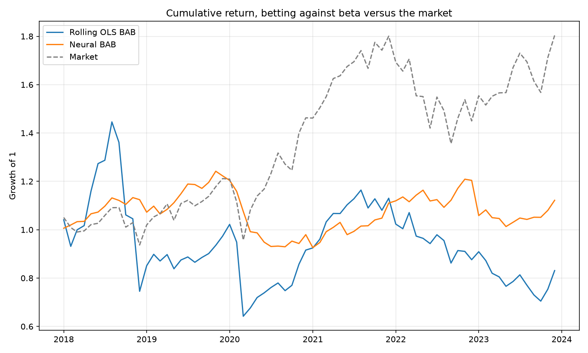

# Assignment 7: Neural Beta with an MLP

Estimate a time-varying market beta with a neural network instead of a rolling
regression. The network never sees a beta label. It outputs a beta, that beta is
used to predict next month's return, and the prediction error is what gets minimised.

## Idea

A small MLP maps a feature vector at time `t` to a single number, `beta_hat`.
Next month's return is then reconstructed as

```
r_hat(t+1) = alpha + beta_hat * mkt(t+1)
```

where `alpha` is one learned scalar shared across the panel. The loss is the RMSE of
`r_hat` against the realised return. Beta is identified as whatever value makes that
reconstruction work, so it comes out of the training loop rather than a regression
window.

The output layer is left linear. Betas can be negative, and any squashing activation
on the output would rule that out.

## Data

CRSP monthly returns (`MSF_1996_2023.csv`) for 2005 to 2023, restricted to 10 firms
in each of 8 industries, plus Fama-French factors (`FAMA.csv`). Neither file is
committed.

Each sample stacks a 12-month lookback of the firm's own returns and the market
return, plus 8 industry dummies, for 32 input features. The Fama-French variant adds
12 months each of Mkt-RF, SMB, HML, and RF, for 80 features.

Splits are by year: train 2005 to 2012, validate 2013 to 2017, test 2018 to 2023.
That gives 16,165 samples overall and 4,418 in the test set.

## Tuning

Grid over hidden units [32, 64, 128], learning rates [1e-2, 1e-3, 3e-4],
activations [linear, sigmoid, tanh, relu], and lookback [12, 24, 36]. The winner was
128 hidden units, learning rate 3e-4, ReLU, 12-month lookback, trained for 30 epochs
with batch size 256.

The grid is gated behind a `done = True` flag in the notebook so it does not re-run
on every execution. The chosen values are hardcoded in the cell that follows it.

## Results

| Model | Val RMSE | Test RMSE |
| --- | --- | --- |
| Returns and industry (32 features) | 0.0877 | 0.1280 |
| Plus Fama-French factors (80 features) | 0.0886 | 0.1323 |

Predicted beta by industry, test set, base model:

| Industry | N | Mean beta | Std | Median |
| --- | --- | --- | --- | --- |
| Transportation | 360 | 1.300 | 0.252 | 1.302 |
| Finance | 648 | 1.117 | 0.307 | 1.154 |
| Services | 576 | 1.110 | 0.366 | 1.185 |
| Wholesale | 539 | 1.095 | 0.421 | 1.183 |
| Construction | 576 | 1.094 | 0.342 | 1.199 |
| Retail | 470 | 0.980 | 0.303 | 1.050 |
| Manufacturing | 601 | 0.912 | 0.376 | 0.834 |
| Mining | 648 | 0.844 | 0.407 | 0.764 |

Same table with Fama-French factors added:

| Industry | Mean beta | Std |
| --- | --- | --- |
| Transportation | 1.380 | 0.601 |
| Finance | 1.281 | 0.620 |
| Construction | 1.261 | 0.639 |
| Services | 1.258 | 0.637 |
| Wholesale | 1.229 | 0.661 |
| Retail | 1.198 | 0.630 |
| Manufacturing | 1.140 | 0.654 |
| Mining | 1.095 | 0.643 |

Beta-sorted quintile portfolios over the test period, Fama-French model.
**These numbers are superseded**; see *Strategy extension* below for why and
for the construction that replaces them:

| Quintile | Mean beta | Equal-weighted return | Value-weighted return |
| --- | --- | --- | --- |
| 1 | 0.315 | 0.0138 | 0.0307 |
| 2 | 0.857 | 0.0142 | 0.0177 |
| 3 | 1.243 | 0.0205 | 0.0104 |
| 4 | 1.578 | 0.0093 | 0.0166 |
| 5 | 2.115 | 0.0063 | 0.0156 |
| Q5 minus Q1 | | -0.0074 | -0.0151 |

## What the numbers say

Adding Fama-French factors made the model worse on both validation and test RMSE,
and it flattened the cross-section. Industry means compress into a 1.10 to 1.38 band
and every standard deviation roughly doubles. The extra 48 inputs give the network
more ways to fit the training window without improving what it learns about beta.

The base model's industry ordering is the sensible one. Transportation is highest at
1.30, and the test window covers 2020, when transport names moved hardest with the
market. Mining and manufacturing sit below 1.

Both quintile spreads are negative. High-beta stocks underperformed low-beta stocks
over 2018 to 2023, by 74 basis points per month equal-weighted and 151 basis points
value-weighted. This looks like the betting-against-beta pattern and it runs against
what CAPM predicts.

That reading does not survive a closer look at how the numbers were built, which is
what the extension below is for.

## Strategy extension

The quintile table above is the most interesting result in the assignment and the
least defensible as it stands. Three things are wrong with it.

**The betas are attached to the wrong firm-months.** `build_neuralbeta_arrays` drops
the first `lookback` rows of *each firm's* history, but the notebook reattaches the
predictions by prepending `test_df.height - len(beta_pred)` NaNs to the top of the
panel. That is the total dropped across all 80 firms, applied as a single offset in
one place, so nearly every prediction lands on a different firm than the one it was
computed for. The diagnostic cell added to the notebook reports the exact share.

**The sort is pooled, not monthly.** The ranking runs over all 4,418 test
observations at once, so a 2018 observation and a 2022 observation compete for the
same bucket. The resulting "Q5 minus Q1" is a difference between two averages taken
over different periods, not a return on a portfolio anyone could have held. The
value-weighted version compounds this by weighting with the contemporaneous market
cap, which lets a stock's own return in the holding month set its own weight.

**A raw Q5-minus-Q1 spread is not a test of the CAPM.** It is long roughly one unit
of market. Over 2018 to 2023 the market rose, so market exposure pushed the spread
*up* while the reported number came out negative. Whatever the spread measures, the
market component has to come out before it can be read as an anomaly.

### What replaces it

`bab.py` rebuilds the analysis around portfolios that could actually be held:

- Betas ranked **within each month**, quintiles re-formed every month, held one month.
- Value weights taken from the market cap at **formation**, not at the end of the
  holding month.
- A **Frazzini-Pedersen BAB factor**: rank-weighted long the low-beta half, short the
  high-beta half, each leg levered to beta one so the factor is beta neutral at
  formation. This is the construction the anomaly is actually defined by, and it
  needs no market adjustment afterwards.
- **Newey-West** t-statistics throughout, since monthly portfolio returns are
  autocorrelated and a plain t-test overstates significance.
- Alphas against the Fama-French factors, Sharpe, maximum drawdown, turnover,
  returns net of costs, and the break-even cost that erases the gross return.
- The same machinery run on a **60-month rolling OLS beta**, so the question becomes
  the one worth asking: does trading on the learned beta beat trading on the
  regression it replaces?

The two constructions answer different questions, which the tests pin down. A
security market line that is too flat — a constant alpha shared by every stock —
shows up in the levered BAB factor and cancels exactly out of an unlevered
Q5-minus-Q1 difference. An alpha proportional to beta does the reverse: it survives
in the spread's market-adjusted alpha and is absorbed entirely when each leg is
levered to beta one. Reporting only one of the two hides half the picture.

### Universe

`--universe assignment` reproduces the notebook's panel: ten firms per industry,
each with a complete history over the whole sample. That filter is applied with
hindsight. It keeps only firms that survived to 2023 and removes every delisting,
which is precisely the set of returns a strategy would not have earned. It also
leaves about 16 names per quintile, so a bucket return is a handful of stocks rather
than a portfolio.

`--universe wide` keeps every firm in the extract and lets the estimation window
decide when a firm becomes tradable, which is the decision an investor could have
made at the time. On synthetic data with a known planted effect, narrowing from 120
firms to the 80-firm survivor panel cut the BAB t-statistic from 1.56 to 0.97 on
identical returns, which is roughly what the narrower universe costs in power.

### Two data notes

`RET` includes dividends and is what a holder actually earns; the notebook fits and
sorts on `RETX`, which excludes them. `run_bab.py` defaults to `RET` for returns and
takes `--return-col RETX` to match the notebook.

The Ken French factor files are distributed in percent while CRSP returns are
decimals, and the notebook joins the two without rescaling. Any regression on those
factors is off by 100x, and in the 80-feature variant the factors enter the network
as inputs two orders of magnitude larger than every other feature — which is a
plausible part of why adding them made test RMSE worse. `bab.load_fama_french`
detects the scale and normalises to decimals.

### Running it

Either export the betas from the last section of the notebook, or train on the full
tape directly:

```bash
python train_neural_beta.py --msf MSF_1996_2023.csv --out neural_betas.csv
python run_bab.py --msf MSF_1996_2023.csv --fama FAMA.csv \
                  --betas neural_betas.csv --start 2018 --end 2023 \
                  --universe wide --plot bab.png
python diagnose_beta.py --msf MSF_1996_2023.csv --betas neural_betas.csv
```

`run_bab.py` reads whichever date format the WRDS export used, keeps share codes 10
and 11, and takes `--min-price` for the robustness check above. The Fama-French file
is the monthly research factors from Ken French's data library, reduced to
`date,Mkt-RF,SMB,HML,RF` with the `YYYYMM` column named `date`.

Every table prints as markdown, ready to paste back into this file. Without
`--betas` the script still runs on the rolling-regression benchmark alone, which is
a quick way to check the plumbing before wiring the network in.

### Tests

```bash
python test_bab.py
```

17 checks, all passing. The portfolio and factor machinery is verified against simulated panels
whose data-generating process fixes the right answer in advance: a planted flat
security market line has to come back through the BAB factor at the level the
leverage arithmetic implies, a planted beta-proportional alpha has to come back
through the spread's alpha and not through BAB, and a panel with no anomaly has to
produce no significant factor. The rest are hand-computed: bucket returns, rank
weights, turnover, drawdown, break-even cost, and the month index round-tripping
across December.

### Results

Run on the full CRSP common-stock tape (SHRCD 10 and 11), 1,636,563 firm-months and
15,862 firms, 1996 to 2023. The network was retrained on this universe with the
notebook's tuned settings: 128 hidden units, ReLU, lr 3e-4, 12-month lookback, batch
256, 30 epochs, train 2005-2012, validate 2013-2017, test 2018-2023. Features are
built once over the whole panel and split by the target month, so no months are lost
at the split boundaries. Fama-French factors come from Ken French's data library.

Trading 2018 to 2023: 72 months, a median of 3,709 names per month, neural betas
covering 91.5% of traded firm-months and rolling betas 77.5%.

**The headline: the network did not learn beta. It learned volatility.**

| Predicted beta correlates with | Neural | Rolling OLS |
| --- | --- | --- |
| Trailing 12-month volatility | **0.588** | 0.272 |
| A 60-month regression beta | 0.235 | — |
| Trailing 12-month return | -0.102 | 0.036 |
| Previous month's return | -0.203 | -0.001 |

Mean within-month cross-sectional correlations over the 217,066 firm-months where
both estimates exist, from `diagnose_beta.py`. The learned beta tracks the firm's own
return dispersion two and a half times more closely than it tracks the thing it is
named after.

The distributions say the same:

| | Mean | Std | p1 | p99 | Share negative | Median monthly change |
| --- | --- | --- | --- | --- | --- | --- |
| Neural | 1.169 | 0.349 | 0.614 | 2.185 | **0.00%** | 0.130 |
| Rolling OLS | 1.247 | 0.807 | -0.350 | 3.621 | 2.27% | 0.025 |

The learned beta is **never negative once**, in the 217,066 firm-months compared here
or across all 256,292 it was estimated for, where its minimum is 0.394. A real beta is
negative 2.3% of the time; a volatility is negative never. It also carries less than
half the cross-sectional dispersion while moving five times as much month to month,
so it is simultaneously more compressed and noisier — and it costs four times the
turnover to trade.

This follows from the objective. The loss is the RMSE of `alpha + beta * mkt` against
the realised return. In a month when the market barely moves, the cheapest way to
reduce squared error on a firm that swung 20% is to hand it a large beta, whatever
its actual co-movement. The training curve agrees that little was learned: validation
RMSE was 0.15179 at epoch 1 and 0.15193 at epoch 30, with the best epoch being the
second. Test RMSE was 0.211, against 0.128 in the notebook — not comparable, since
that figure came from 80 large survivors rather than the whole tape.

**Strategy results, 2018 to 2023, equal-weighted.** `ff_alpha` is the monthly alpha
against Mkt-RF, SMB and HML, with Newey-West t-statistics throughout.

| Strategy | Mean monthly | t | Sharpe | FF alpha | alpha t | Turnover |
| --- | --- | --- | --- | --- | --- | --- |
| Rolling OLS, Q5-Q1 | 0.0062 | 0.75 | 0.33 | 0.0012 | 0.27 | 0.23 |
| Rolling OLS, BAB | 0.0010 | 0.11 | 0.04 | -0.0072 | -1.13 | |
| Neural, Q5-Q1 | -0.0006 | -0.06 | -0.02 | -0.0060 | -1.12 | 0.95 |
| Neural, BAB | 0.0021 | 0.50 | 0.23 | 0.0020 | 0.69 | |

Value-weighted, the rolling-OLS spread is 0.0096 (t = 1.05) and the neural spread
-0.0005 (t = -0.11).

**Nothing here is significant.** There was no betting-against-beta premium on either
estimator over this window, and the learned beta did not beat the regression it was
meant to replace on any of return, Sharpe, alpha or turnover.

**The original result does not replicate.** The superseded table above reports -74bps
equal-weighted and -151bps value-weighted. Rebuilt with betas attached to the correct
firm-months and portfolios re-formed monthly, on the same universe construction rule
of ten firms per industry with complete histories, the equal-weighted spread is
**+203bps per month** (t = 1.61) for the neural beta and +239bps (t = 1.90) for
rolling OLS. The sign flips. That panel is a different random draw of firms than the
notebook's, so this is not an exact reproduction of those 80 firms, but the direction
is the same as on the full tape and the original negative spread appears nowhere.

**A routine screen flips the sign, which is its own warning.** Dropping stocks under
$5 at formation — a standard filter, since equal-weighted sorts over the whole tape
are dominated by microcaps nobody can trade — moves the neural BAB factor from
+0.0021 (t = 0.50) to **-0.0087 (t = -2.06)**, alpha -0.0082 (t = -2.81), and the
neural Q5-Q1 spread from -0.0006 to +0.0245 (t = 3.70) with an alpha of 0.0195
(t = 4.92). A result that reverses on a $5 price screen is a statement about which
stocks are in the sample, not about beta. The value-weighted version of that same
spread is 0.0051 (t = 1.18), which locates it in small names.



Over 2018 to 2023 the market nearly doubled while both BAB variants ended flat to
down: rolling OLS finished at 0.83 times capital, the neural version at 1.12, against
1.80 for the market.

### What this means for the project

The interesting finding is no longer the quintile spread. It is that a network
trained to minimise return-reconstruction error learns conditional volatility and
calls it beta. That is a real and diagnosable failure of the objective, it is
visible in four independent places — the correlation with volatility, the complete
absence of negative values, the compressed dispersion, the flat validation curve —
and it explains why the betas do not sort returns the way a beta should.

`diagnose_beta.py` regenerates both tables above, and needs no portfolio at all: a
beta estimator can be judged on whether it behaves like a beta before anyone asks
whether it makes money.

It also points at the fix, which is the natural next step: identify beta from
co-movement rather than from return magnitude. Predicting a vector of factor
loadings against `r = alpha + beta'F` gives the network something magnitude alone
cannot satisfy, and penalising the residual correlation with the market gives beta
a target that volatility cannot imitate.
