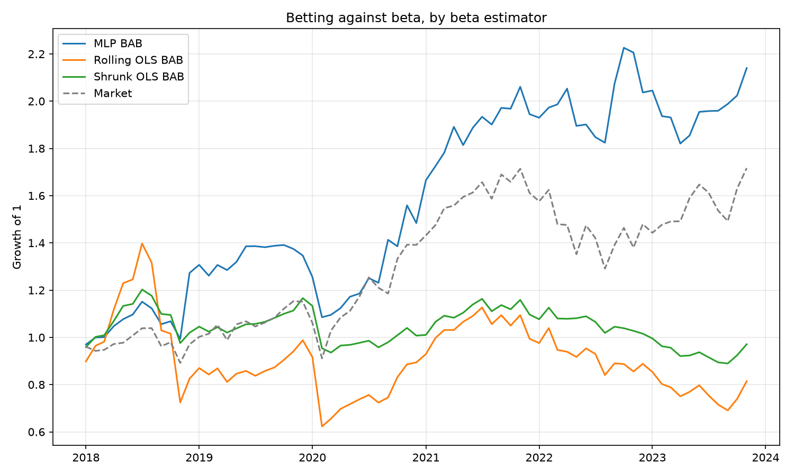

# Neural Beta

Can a neural network estimate a stock's market beta better than a rolling
regression, and is the difference worth trading?

Beta is estimated without ever being labelled. The network maps a firm's
point-in-time features to a single number, that number is used to reconstruct
next month's return as

```
r(i, t+1) = alpha + beta(i, t) * mkt(t+1)
```

and the squared error of that reconstruction is the loss. Beta comes out as
whatever value makes the reconstruction work, so it is identified by the
training objective rather than fitted in a regression window. `alpha` is one
scalar shared across the panel. The output layer is linear, because a beta can
be negative.

## Timing

One convention governs the whole repository, and every guarantee below rests
on it:

```
features for firm i use returns through month t  ->  beta(i, t)
portfolio formed at the close of month t
position earns r(i, t+1)
```

A row keyed `(i, t)` therefore contains only what was knowable when the
position was opened. Rolling windows end at `t` inclusive; the label is the
`t+1` return pulled back to row `t`.

## Point-in-time guarantees

Look-ahead in a backtest is usually not a visible mistake, it is an assumption
nobody wrote down. These are written down and tested in `test_pit.py`:

- **Truncation.** Features are built twice, once on the full history and once
  on a history stopping at `T`, and every row at or before `T` must come out
  identical. If any feature peeked forward, deleting the future would move it.
  All 39 features pass.
- **Scalers are fitted per fold.** Standardising inputs is what makes this
  network train at all, and standardising over the whole panel carries future
  means and variances backwards into every earlier row. Each fold's scaler is
  estimated on its training data alone.
- **Windows never bridge a gap.** Rolling statistics run on row position, so a
  firm that stops trading for a year and relists would otherwise have a window
  spanning the hole. Consecutive months are numbered into blocks and every
  window is computed inside one unbroken run.
- **Labels never bridge a gap** either; `ret_next` survives only where `t+1` is
  genuinely the next calendar month for that firm.
- **No survivorship filter.** Firms enter and leave as they actually did.
  Nothing is selected on what a firm did later.
- **Size is the formation value.** Value weights use market cap at `t`, never
  at `t+1`, so a stock's own holding-month return cannot set its own weight.

## Walk-forward

The model is refit once a year. For test year `Y` it trains on labels through
December of `Y-2`, validates on `Y-1`, and predicts `Y`. Since a feature row in
December of `Y-1` is scored on January of `Y`, cutting training at `Y-2` keeps
every label the fit ever sees strictly before the test year. Six refits cover
2018 to 2023.

## Data

CRSP monthly, 1996 to 2023, ordinary common shares only (share codes 10 and
11): 1,636,563 firm-months across 15,862 firms. After the 60-month feature
windows, 1,074,426 firm-months across 10,724 firms are usable. The traded
sample is 212,569 firm-months, 4,108 firms and 71 months, a median of 2,992
names a month.

Fama-French factors come from Ken French's data library. They ship in percent
while CRSP returns are decimals, so they are rescaled on load; mixing the two
silently multiplies every factor by 100.

## Features

48 inputs, all as of month `t`: rolling beta, correlation, volatility and mean
return over 12, 36 and 60-month windows; twelve months each of the firm's own
and the market's returns; log market cap; industry dummies.

The rolling 60-month beta is deliberately included. Handing the network the
benchmark's own estimate makes the comparison fair — the network can only win
by improving on what the regression already sees, not by being shown more.

## Benchmarks

| | |
| --- | --- |
| Rolling OLS | 60-month regression beta ending at the formation month |
| Shrunk OLS | `0.67 * rolling + 0.33`, the Blume adjustment toward one |
| Beta = 1 | no estimation at all, the honest null |

## Results

### Does the beta hedge?

The first question is not whether a beta sorts returns but whether it does the
job a beta is for. Variance of `r(t+1) - beta * mkt(t+1)`, against the
unhedged return as baseline:

| Estimator | Variance removed | Mean | SD | Share negative |
| --- | --- | --- | --- | --- |
| Shrunk OLS | **9.23%** | 1.165 | 0.537 | 0.73% |
| Beta = 1 | 8.96% | 1.000 | 0.000 | 0.00% |
| Rolling OLS | 7.95% | 1.246 | 0.802 | 2.23% |
| MLP | 7.80% | 1.176 | 0.714 | 0.11% |

**Assuming every beta is 1 hedges better than estimating it.** Both estimators
lose to a constant, and the shrinkage that pulls a regression beta most of the
way back toward 1 is what wins. At monthly frequency on individual stocks the
cross-sectional beta signal is small relative to the noise in measuring it,
and the measurement error costs more than the signal is worth.

This is not an artifact of under-training. Sweeping the learning rate across
two orders of magnitude on the 2020 fold moves validation error in the fourth
decimal and never beats the constant:

| Learning rate | 3e-5 | 1e-4 | 3e-4 | 1e-3 | 3e-3 | Beta = 1 | Rolling OLS |
| --- | --- | --- | --- | --- | --- | --- | --- |
| Validation MSE | 0.028568 | 0.028680 | 0.028841 | 0.028661 | 0.028514 | **0.028434** | 0.028796 |

Validation MSE here *is* hedge error, so this is the right quantity to select
on, and every configuration lands in the same place.

### What does each estimate track?

Mean within-month cross-sectional correlation:

| Estimator | Trailing 12-month volatility | 60-month regression beta |
| --- | --- | --- |
| MLP | 0.520 | 0.519 |
| Rolling OLS | 0.280 | 1.000 |

The network's output is half regression beta and half volatility. That pull
toward volatility follows from the objective: in a month when the market
barely moves, the cheapest way to cut squared error on a firm that swung 20%
is to hand it a large beta, whatever its actual co-movement. It is a real
property of this loss, not a bug — but it is bounded, and the MLP still
produces negative betas where they belong.

### Trading

Monthly-rebalanced quintile sorts and a Frazzini-Pedersen beta-neutral BAB
factor, equal-weighted, costed at 10bps per unit of weight traded. `ff_alpha`
is the monthly alpha against Mkt-RF, SMB and HML; all t-statistics are
Newey-West.

| Strategy | Mean | t | Sharpe | FF alpha | alpha t | Turnover | Net |
| --- | --- | --- | --- | --- | --- | --- | --- |
| **MLP, BAB** | **0.0124** | **1.85** | **0.73** | **0.0092** | **2.13** | 1.65 | 0.0114 |
| Rolling OLS, BAB | 0.0007 | 0.07 | 0.03 | -0.0071 | -1.12 | 0.28 | 0.0019 |
| Shrunk OLS, BAB | 0.0003 | 0.07 | 0.03 | -0.0030 | -0.85 | 0.21 | 0.0007 |
| MLP, Q5-Q1 | -0.0014 | -0.17 | -0.07 | -0.0065 | -1.41 | 1.39 | -0.0025 |
| Rolling OLS, Q5-Q1 | 0.0058 | 0.70 | 0.31 | 0.0008 | 0.19 | 0.23 | 0.0059 |

Blume shrinkage is monotone, so it produces the same quintiles as the raw
regression and differs only in the levered BAB factor.

For scale, over the same 71 months: Mkt-RF returned 0.85% a month (t = 1.60),
SMB -0.03% (t = -0.08) and HML -0.17% (t = -0.28).



The MLP's BAB factor is the only strategy here that produces a significant
alpha, 92bps a month at t = 2.13, with a Sharpe of 0.73 against 0.03 for both
regression versions. It ends the period at 2.14 times capital against 1.72 for
the market.

### The result does not survive a price screen

Dropping stocks under $5 at formation — a standard filter, since equal-weighted
sorts over the whole tape are dominated by microcaps with wide spreads — takes
the MLP BAB factor from 124bps a month (t = 1.85) to **54bps (t = 0.99)**, and
its alpha from 92bps (t = 2.13) to 36bps (t = 0.95). The regression versions
stay near zero either way.

So the one significant result lives in the cheapest, least liquid part of the
market. It also turns over 1.65 times a month, which puts its break-even cost
at roughly 75bps per unit traded — plausible for liquid names and optimistic
for sub-$5 stocks, where the bid-ask spread alone can exceed it.

## What this shows

Three things, in order of how much they survive scrutiny.

**A conditional beta is not worth estimating at monthly frequency.** The
constant beta of 1 hedges better than a 60-month regression and better than a
network with 48 features and the regression's own estimate among them. Nothing
in the loss curve says so; it takes benchmarking against doing nothing.

**The objective pulls beta toward volatility.** Minimising return
reconstruction error rewards large betas for volatile stocks regardless of
co-movement. Here it leaves the network's output half beta and half
volatility, which is enough to change what the sorts do.

**A significant alpha and a tradable strategy are different claims.** The MLP
BAB factor clears the usual bar — 92bps a month, t = 2.13, Sharpe 0.73, costed
and beta-neutral — and then fails a $5 price screen. The screen is the finding,
not a footnote.

## Files

| | |
| --- | --- |
| `pit.py` | point-in-time panel and features |
| `walkforward.py` | annual refit, train-fold scaling, beta export |
| `evaluate.py` | hedging, tracking, strategies, Fama-French comparison |
| `bab.py` | portfolio and factor machinery, Newey-West, turnover, costs |
| `test_pit.py` | 6 look-ahead checks, including truncation |
| `test_bab.py` | 17 checks of the portfolio and factor math |
| `neural-beta.ipynb` | the original coursework notebook this grew out of |

## Running

The CRSP and factor files are licensed and not committed.

```bash
python walkforward.py --msf MSF_1996_2023.csv --out betas_pit.csv
python evaluate.py --msf MSF_1996_2023.csv --fama FAMA.csv \
                   --betas betas_pit.csv --plot bab_pit.png
python evaluate.py --min-price 5      # the robustness check above
```

## Tests

```bash
python test_pit.py && python test_bab.py
```

23 checks. The portfolio machinery is verified against simulated panels whose
data-generating process fixes the answer in advance — a planted flat security
market line must come back through the BAB factor at the level the leverage
arithmetic implies, a planted beta-proportional alpha must come back through
the spread's alpha and not through BAB, and a panel with no anomaly must
produce no significant factor. The look-ahead checks are structural: truncate
the future and the past must not move.
