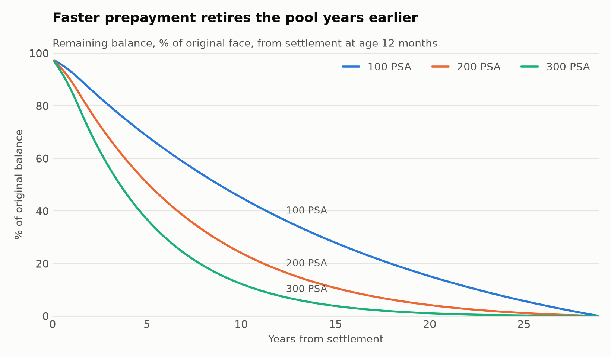
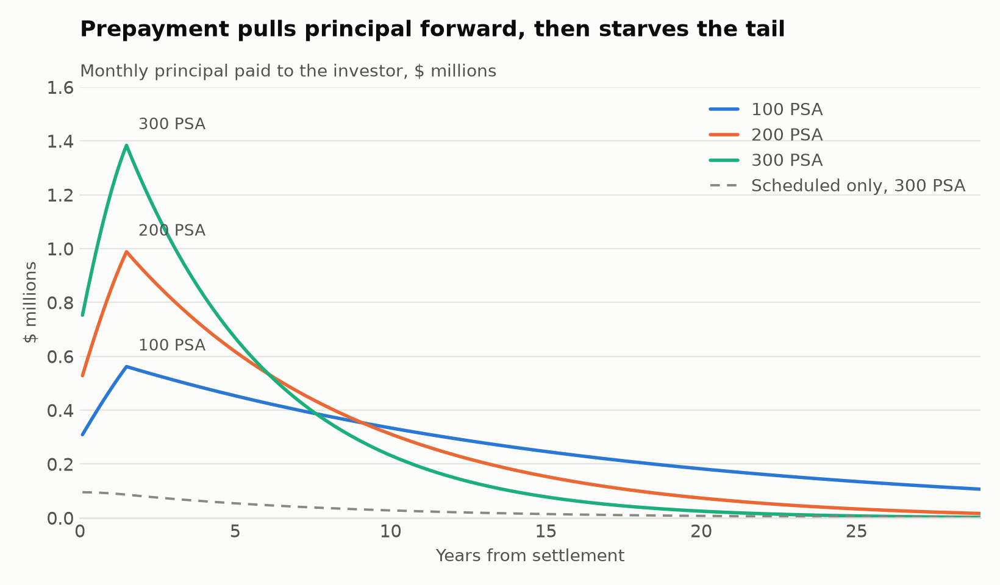
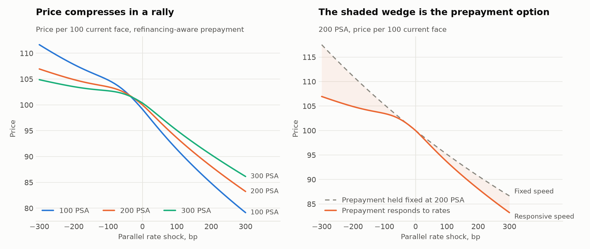

# Assignment 11: Agency MBS Cash Flows and Prepayment

Price a 30-year fixed-rate agency pass-through under 100, 200, and 300 PSA, and
measure what happens to it when rates move. The point of the exercise is the last
part. A mortgage pool is a bond whose holder is short an option they did not
choose to sell, and the model exists to put a number on that.

## The pool

| | |
| --- | --- |
| Original balance | $100,000,000 |
| Mortgage rate (gross) | 6.50% |
| Pass-through coupon (net) | 6.00% |
| Servicing and guarantee strip | 50bp |
| Original term | 360 months |
| Age at settlement | 12 months |
| Current face | $97.59mm, after twelve months at 100 PSA |

## Data

| Source | Series | Contribution |
| --- | --- | --- |
| FRED | `DGS1MO` ... `DGS30` | Constant-maturity Treasury par yields, bootstrapped to zeros |
| FRED | `MORTGAGE30US` | The rate a borrower can refinance into today |

Both are pulled over HTTP with no API key and cached in `curve_snapshot.json`,
which is committed, so everything here runs offline and reproduces exactly.
`python curves.py --refresh` replaces the snapshot with today's data.

The snapshot is dated 2026-09-15: a 5.00% ten-year Treasury and a 6.76% thirty-year
mortgage rate. Against a 6.50% pool that is a **refinancing incentive of −26bp** —
the pool is slightly out of the money, so extension is the live risk and
contraction is the tail.

## Method

**Amortization.** Each month the scheduled payment is recomputed from the balance
actually outstanding and the term actually remaining, at the gross mortgage rate.
That is what keeps the schedule consistent after a prepayment: the borrowers who
stay carry on with the same loans, and the pool-level payment just scales down.
Interest splits at the coupon — the investor receives 6.00% on the beginning
balance, the servicer and guarantor keep the 50bp strip, and neither ever sees the
other's share.

**Prepayment.** The PSA benchmark ramps CPR by 0.2% a month for 30 months to a 6%
plateau; 200 PSA is twice that curve, 300 PSA three times. The monthly rate is

$$\text{SMM} = 1 - (1 - \text{CPR})^{1/12}$$

which is *above* CPR/12, not below it — 6% CPR is 0.5143% a month, because each
month prepays out of a balance the earlier months have already shrunk. Prepayment
applies to what is left after scheduled principal.

**Refinancing incentive.** The feature that makes this an MBS rather than an
amortizing bond. Incentive is the borrower's note rate less the rate available
today, and the speed multiplier is a logistic S-curve in it:

- deeply out of the money, only turnover prepays and the curve flattens near 0.4x
- around a 75bp threshold, borrowers react sharply — closing costs have to be
  earned back before anyone bothers
- deeply in the money, everyone who can refinance already has, and it flattens again
- **burnout** decays the *excess* over the base speed as the pool refinances away,
  and leaves turnover alone

The curve is normalised so the multiplier is exactly 1.0 at today's incentive. That
keeps the scenario labels honest: a "200 PSA" pool really runs at 200 PSA in the
base case, and the dial only expresses the *response* to a rate move. Without the
normalisation every quoted speed would silently be something else.

The parameters are judgmental, not fitted — there is no loan-level performance data
here to fit them to. They are set so that a 50bp rally roughly doubles the speed and
a 50bp selloff cuts it by about a third, which is the right order of magnitude for a
generic conventional pool.

**Pricing.** Cash flows are discounted at the bootstrapped zero rate for each
flow's own maturity plus a flat spread. The spread is not an input: it is solved
once so that the pool prices to par at 200 PSA, then held fixed everywhere else, so
the only thing moving between scenarios and shocks is the prepayment assumption.
The solved spread is **104bp**.

Treasury constant maturities are quoted as par yields, so they are bootstrapped to
zeros on a semiannual grid before anything is discounted. Using them as if they were
zeros would overstate the discount rate on every intermediate cash flow, and this
pool has 348 of those.

**Risk.** Effective duration and convexity come from ±50bp parallel shocks with
full revaluation — the cash flows are rebuilt from scratch in each scenario, not
held fixed and rediscounted. The shock moves the discount curve *and* the market
mortgage rate together, one for one. Shocking the curve while leaving the mortgage
rate alone would hide the feature being measured.

$$D_{\text{eff}} = \frac{P_- - P_+}{2 P_0 \Delta y} \qquad
C_{\text{eff}} = \frac{P_+ + P_- - 2P_0}{P_0 (\Delta y)^2}$$

## Results

Price is per 100 of current face. Convexity is the raw measure above, in years
squared; divide by 100 for the per-1% quote.

| Scenario | Price | WAL | Effective duration | Convexity |
| --- | --- | --- | --- | --- |
| 100 PSA | 99.163 | 10.76 | 7.51 | −235 |
| 200 PSA | 100.000 | 7.00 | 5.57 | −365 |
| 300 PSA | 100.360 | 5.04 | 4.28 | −374 |

### The headline

Turning the refinancing dial off and on, with nothing else changed:

| Scenario | Fixed speed: D | Fixed speed: C | Responsive: D | Responsive: C | WAL at −50 / 0 / +50bp |
| --- | --- | --- | --- | --- | --- |
| 100 PSA | 6.90 | **+82** | 7.51 | **−235** | 8.61 / 10.76 / 12.34 |
| 200 PSA | 5.06 | **+46** | 5.57 | **−365** | 5.25 / 7.00 / 8.70 |
| 300 PSA | 3.95 | **+28** | 4.28 | **−374** | 3.68 / 5.04 / 6.53 |

**Convexity changes sign.** Held at a fixed speed, the pool is an ordinary
amortizing bond with positive convexity, worth more than a linear approximation
in either direction. Let the speed respond to rates and it becomes worth less in
both. At 200 PSA a 50bp rally gains 2.33 points while a 50bp selloff loses 3.24.

The mechanism is in the WAL column and nowhere else:

- **rates fall** → the pool moves into the money → borrowers refinance → WAL
  contracts from 7.00 to 5.25 years → the principal comes back early and has to be
  reinvested at the new, lower rate, exactly when the holder least wants it
- **rates rise** → the pool moves further out of the money → borrowers stay →
  WAL extends from 7.00 to 8.70 years → the money is locked up in a
  below-market coupon, exactly when the holder most wants it back

Both directions run against the holder. That is negative convexity, and it is not
a modelling artifact — it is the borrower's prepayment option being exercised
rationally.

**Faster pools are less convex, not more.** Duration falls from 7.51 to 4.28 as
the base speed goes from 100 to 300 PSA, which is the intuitive part. Convexity
gets *worse*, from −235 to −374, because a pool already prepaying quickly has more
speed available to lose when rates back up, and a fast pool's price is pinned near
par in a rally by principal returning at 100.

### Where it shows up in the charts



At 300 PSA the pool is half gone in under five years and effectively retired by
twenty; at 100 PSA it is still paying at thirty. Same loans, same coupon, three
different assets.



The dashed line is scheduled amortization alone at 300 PSA. Almost everything above
it is borrowers leaving. Prepayment pulls the cash forward into a spike at the top
of the PSA ramp and starves the tail.



Left: price against parallel shocks under all three speeds. The curves flatten
above the base case instead of steepening — the price ceiling a callable asset
runs into. Right: the same 200 PSA pool with prepayment held fixed against
prepayment allowed to respond. The shaded wedge is what the holder gave up, about
10.6 points of price in a 300bp rally.

## Optional extension: option-adjusted spread

A static spread prices the prepayment option at zero, because it assumes rates
follow exactly one path — the forwards. `oas.py` replaces that with 1,000
simulated paths from a one-factor Hull-White model

$$dr = (\theta(t) - a r)\,dt + \sigma\,dW$$

fitted to the initial curve exactly by the standard $r(t) = x(t) + \alpha(t)$
decomposition, so every simulated path is consistent with today's discount factors
by construction rather than by calibration. `test_mbs.py` checks that directly:
20,000 paths reprice the whole zero curve to within 6bp of price.

On each path the 10-year rate is read off in closed form (Hull-White bond prices
stay affine in the short rate), the mortgage rate is that plus a fixed 176bp
primary spread, and the refinancing incentive, CPR, and cash flows are recomputed
month by month. The OAS is then bisected to match a market price:

| | Static spread | OAS | Option cost |
| --- | --- | --- | --- |
| 200 PSA base, priced at par | 104.1bp | **62.7bp** | 41.4bp |
| 300 PSA base, priced at par | 113.2bp | 68.1bp | 45.2bp |

About **40bp of the 104bp static spread is not compensation at all** — it is the
price of the option the holder wrote. What is left is what they are actually paid
for liquidity, agency credit, and model error.

The option cost behaves the way an option should:

| Rate volatility | OAS | Option cost |
| --- | --- | --- |
| 50bp | 87.8bp | 16.3bp |
| 100bp | 62.7bp | 41.4bp |
| 150bp | 32.9bp | 71.2bp |

## Files

| File | Contents |
| --- | --- |
| `mbs.py` | Cash-flow engine, PSA and refinancing-aware prepayment, pricing, WAL, duration, convexity |
| `curves.py` | FRED download, par-to-zero bootstrap, parallel shifts |
| `oas.py` | Hull-White simulation and the OAS solve |
| `run.py` | Produces the results tables and the three figures |
| `charts.py` | Shared chart styling |
| `test_mbs.py` | 22 checks on the arithmetic, the curve, and the simulation |
| `curve_snapshot.json` | Committed market data, so everything reproduces offline |

## Running it

```bash
pip install numpy matplotlib
python run.py                 # tables and the three charts
python run.py --refresh       # pull today's curve from FRED first
python oas.py --paths 1000    # the Monte Carlo extension
python test_mbs.py            # 22 checks
```

## Caveats

The prepayment S-curve is calibrated by judgment, not fitted to loan-level
performance data, so the level of the speeds is assumption and only the *shape* of
the response is defended. Everything downstream of it — the convexity numbers, the
option cost — inherits that. Turnover is folded into the PSA ramp rather than
modelled separately from housing activity, and there is no seasonality, no
loan-size or credit dispersion within the pool, and no default: agency
guarantees make a default look like a prepayment to the investor, which is right
for cash flows and wrong for anyone thinking about the guarantor.

The primary-secondary spread is held fixed at 176bp in the Monte Carlo. It is
itself mean-reverting and widens in stress, which would damp the modelled refi
response exactly when the model says it should be strongest.
